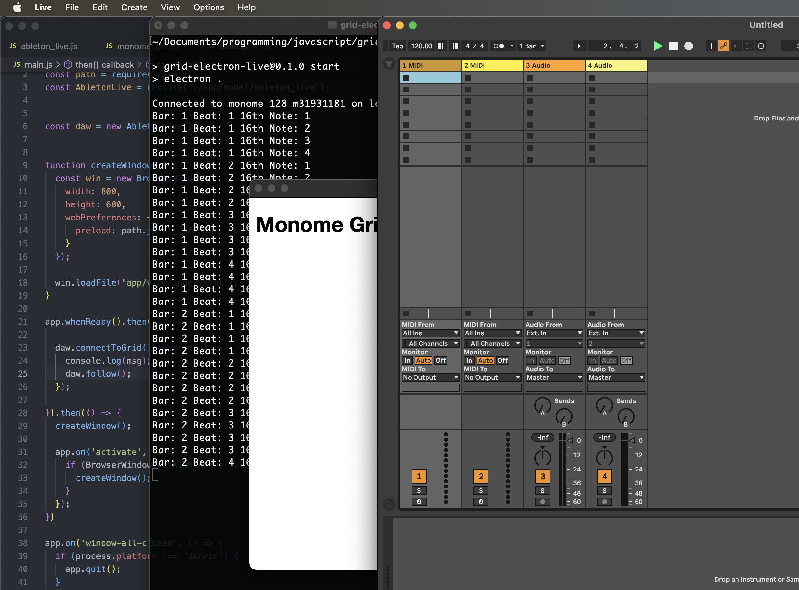

# Step 3: Connect the Electron App to the Ableton Live

In step 3, the next piece of plumbing will involve establishing the first connection between the Electron app and Ableton Live, specifically receiving a MIDI clock signal from Live. To do this we will need to install a MIDI package:

```
$ npm install easymidi
```

This involves a onetime configuration of the MIDI port that will be establsihed. Do the following steps in order:

1. Update the code for the `AbletonLive` class and the `main.js` file to the versions below.
1. Start the Electron app with `npm start`
1. Launch Live and open its MIDI preferences
1. Find the entry named "monome in" that is established in the code below, check its box for Sync

Now, while the Electron app is running in development mode via `npm start` you should see the current transport state logging to your terminal console:

```
$ npm start
```



## Code Updates for Step 3

### `./main.js`

There is only a single line addition. Add the `daw.follow();` statement below to the post-grid connection handler.

```js
  daw.connectToGrid().then((msg) => {
    console.log(msg);
    daw.follow();
  });
```

### `./app/model/ableton_live.js`

This allows Live to send a MIDI clock to the Electron app. In the code below, the MIDI connection is established in the `AbletonLive` class's constructor. The `follow()` method will then process MIDI clock ticks.

The sequencer controller will have a 16th note resolution, therefore it only needs to process every 6th MIDI tick.

```js
const easymidi   = require("easymidi");
const MonomeGrid = require("./monome_grid");


class AbletonLive {
  // For a sequencer with a 16th note pulse, 4 measures will be one "super measure" to enable a 64 step sequence
  superMeasure = 4;
  // 16n step count
  step = 0;


  constructor() {
    this.controller = new MonomeGrid(this);
    this.midiIn     = new easymidi.Input("monome in", true);
  }


  async connectToGrid() {
    const msg = await this.controller.connect();
    return msg;
  }


  async follow() {
    this.midiIn.on("clock", () => {
      this.ticks++;
      // 6 MIDI clock ticks equals a 16th note.
      if (this.ticks % 6 != 0) return;

      console.log(
        "Bar: " + (Math.floor(this.step / 16) + 1) +
        " Beat: " + (Math.floor(this.step / 4) % 4 + 1) +
        " 16th Note: " + (this.step % this.superMeasure + 1)
      );

      this.step = this.step == this.superMeasure * 16 - 1 ? 0 : this.step + 1;
    });

    this.midiIn.on("start", () => {
    });

    this.midiIn.on("position", (data) => {
      if (data.value != 0) return;

      this.ticks = 0;
      this.step  = 0;
    });
  }
}


module.exports = AbletonLive;
```
