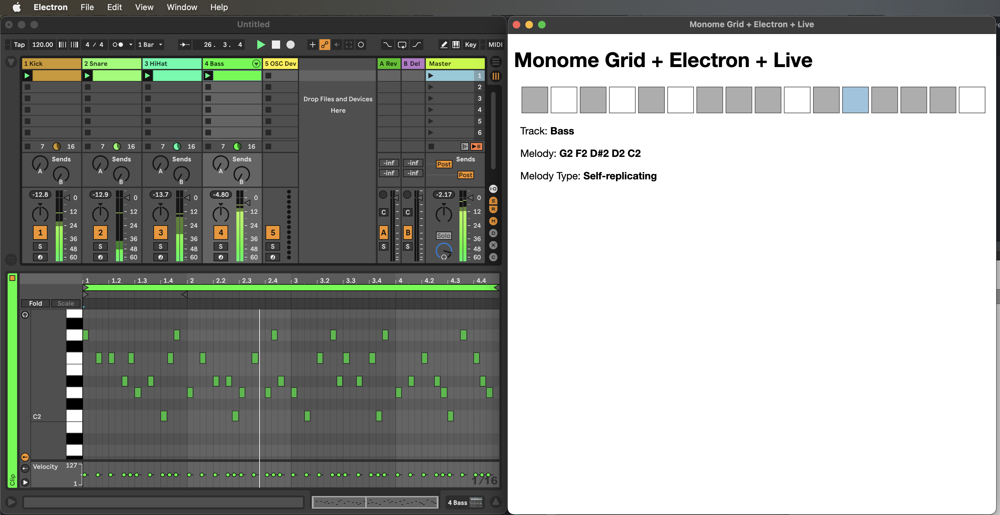

# Step 7: Musical Algorithms

This is the final step in the tutorial and what I hope demonstrates the raison d'être moment: using the foundation developed up to this point as a space for focusing on creative coding for composition and performance. In this step we are going to implement a self-similar melody algorithm.

A self-similar, or self-replicating, melody is one that is the same at multiple ratios. For example, in the code in this tutorial, the melodies can be set to self-replicate at a ratio of 2:1. This means that if you play every note in the melody or if you play every other note in the melody, you will play the same melody. It is a relatively simple algorithm, but one that creates interesting sequences of notes.

## A Place for Musical Algorithms

In the codebase for this Electron app, we will create a file for storing this algorithm (and where you could place other algorithms):

```
$ mkdir app/helpers
$ touch app/helpers/algorithms.js
```

## Implementing the grid Interface

There is still a 4 by 6 matrix of buttons on the grid that currently have no key press events associated with them. We will dedicate the button at row 7, column 16 as a button that will toggle this melody algorithm on or off for the active track. On the code side, the act of toggling the button on the grid hardware will simply update a boolean value in the currently active track, the `selfReplicatingMelody` property of `AbletonTrack`.

## Calling the `selfReplicate()` Algorithm

Whenever this is on, the `AbletonTrack` class will then check if it needs to generate a self-replicating melody within its `abletonNotes()` method:

```js
const melody = this.selfReplicatingMelody ? algorithms.selfReplicate(this.melody) : this.melody;
```

The result will write the self-similar version of the melody into the Ableton Live MIDI clip:



Run the Electron app using `npm start` and try out this new feature.

## Wrapping Up

At this point this tutorial series is concluded. The goal of the tutorial is to demonstrate how to create a bridge between the monome grid hardware and use it as an algorithmic step sequencer/controller for Ableton Live. There's a bit of glue code to wrap your head around, but from this point forward, the plumbing is in place and you can focus your attention on the kinds of things that computer code can do musically.

JavaScript is a very accessible language due to its ubiquity on the web. It is also an extremely fast scripting language, which makes it a good fit for the timing-focused music tech environment. But there is another aspect of the design of this app that is worth pointing out now that you see a simple, but complete picture: notice that the Electron app is truly a controller here. Ableton Live is still the main clock source and we are primarily just sending data to it.

We are even making use of its own data model of tracks and clips. This means that in terms of all the core timing dependent things you want in a computer music environment, no wheels have been reinvented. This little Monome + Electron + Live application architecture is designed to leave a lot of the heavy lifting of the DAW to Live and simply provide a space for you to direct your creative coding in the service of composition and performance.

Happy hacking.

## Code Updates for Step 7

The HTML changes below are a partial addition. All other updates below should replace the Step 6 code.

### `./app/helpers/algorithms.js`

```js
/**
 * Generate a self-replicating melody based on this Melody's steps.
 *
 * @param inputMelody an input melody from which to generate a self-replicating sequence
 * @returns a new melody with steps that self-replicate at the ratio of 2:1
 */
const selfReplicate = (inputMelody) => {
  const ratio = 2, length = 63;

  let sequence = new Array(length).fill(-1);
  sequence[0] = inputMelody[0];
  sequence[1] = inputMelody[1];

  let contiguousSequence, currentNote, stepAmount, nextNote;
  let nextEmpty = sequence.findIndex(note => note == -1),
      count = 2;

  // Build a self replicating melody by powers of 2 until all notes are filled.
  do {
      contiguousSequence = sequence.slice(0, nextEmpty);

      for (let noteIndex = 0; noteIndex < contiguousSequence.length; noteIndex++) {
          // For each note in the contiguous sequence...
          currentNote = contiguousSequence[noteIndex];

          // Determine the self replicating step amounts by computing the powers of 2 for
          // non-redundant step amounts based on the target length
          for (let power = 1; power <= Math.log2(length); power++) {
              stepAmount = ratio ** power;

              // Fill in the melody's future step indices with the current replicating note.
              sequence[(noteIndex * stepAmount) % length] = currentNote;
          }
      }

      // If the sequence still has empty spots, find the first one and fill it with the next
      // note in the input note list.
      nextNote = inputMelody[count % inputMelody.length];
      nextEmpty = sequence.findIndex(note => note == -1);
      if (nextEmpty != -1) sequence[nextEmpty] = nextNote;
      count++;
  } while (nextEmpty != -1);

  return sequence;
}


module.exports = {
  selfReplicate: selfReplicate
}
```

### `./app/model/ableton_track.js`

```js
const AbletonNote = require("./ableton_note");
const algorithms  = require("../helpers/algorithms");


const noteNames = ["C", "C#", "D", "D#", "E", "F", "F#", "G", "G#", "A", "A#", "B"];


class AbletonTrack {
  daw = undefined;
  name = undefined;
  rhythm = [0, 0, 0, 0,  0, 0, 0, 0,  0, 0, 0, 0,  0, 0, 0, 0];
  melody = [60];
  displayMelody = ["C4"];
  selfReplicatingMelody = false;


  constructor(name, abletonLive) {
    this.name = name;
    this.daw  = abletonLive;
  }


  updateRhythm(stepIndex) {
    // Flip the step's current value. If currently 0, set to 1; if 1, set to 0;
    this.rhythm[stepIndex] = 1 - this.rhythm[stepIndex];

    // Update the MIDI clip in Live
    this.daw.setNotes(this);

    // Update the grid display
    this.daw.controller.displayTransport();

    // Update the Electron UI display
    this.daw.electronUi.webContents.send("update-rhythm", this.rhythm);
  }


  setMelody(queuedMelody) {
    // Translate the note data pairs that look like [0, 3], meaning 0=C in the third octave to MIDI note number 36
    this.melody        = queuedMelody.map(noteData => noteData[0] + (noteData[1] * 12) + 24);
    this.displayMelody = queuedMelody.map(noteData => noteNames[noteData[0]] + noteData[1]);

    // Update the MIDI clip in Live
    this.daw.setNotes(this);

    // Update the Electron UI display
    this.daw.electronUi.webContents.send(
      "update-melody",
      this.displayMelody,
      this.selfReplicatingMelody ? "Self-replicating" : "Simple"
    );
  }


  abletonNotes() {
    const melody = this.selfReplicatingMelody ? algorithms.selfReplicate(this.melody) : this.melody;
    const notes  = new Array();

    let melodyIndex = 0;
    for (let i = 0; i < this.daw.superMeasure; i++) {
      const measureOffset = i * 4;
      this.rhythm.forEach((step, i) => {
        if (step == 1) {
          let midiNoteNumber = melody[melodyIndex % melody.length];
          melodyIndex++;

          notes.push( new AbletonNote(midiNoteNumber, ((i * 0.25) + measureOffset), 0.25, 64) )
        }
      });
    }

    return notes;
  }
}


module.exports = AbletonTrack;
```

### `./app/model/monome_grid.js`

```js
const fs        = require("fs");
const path      = require("path");
const yaml      = require("js-yaml");
const serialosc = require("serialosc");


const CONFIG_DIRECTORY = path.resolve(__dirname, "../../config");
const blank16x1Row = [0, 0, 0, 0, 0, 0, 0, 0, 0, 0, 0, 0, 0, 0, 0, 0];


class MonomeGrid {
  device = undefined;
  daw = undefined;
  melodyRecording = 0;
  queuedMelody = new Array();


  constructor(abletonLive) {
    this.daw = abletonLive;
  }


  /**
   * This is fundamentally the same code as the monome website's grid studies.
   */
  async connect() {
    const config = yaml.load(
      fs.readFileSync(
        path.resolve(CONFIG_DIRECTORY, "grid.yml"),
        "utf8"
      )
    );

    return new Promise((resolve, reject) => {
      let addEvent = config.serial + ":add";

      serialosc.start({ startDevices: false });

      serialosc.on(addEvent, (device) => {
        if (this.device)           return;
        if (device.type != 'grid') return;

        this.device = device;
        this.device.on('initialized', () => this.device.on('key', (press) => this.keyPress(press)));
        this.device.start();

        resolve(`Connected to ${this.device.model} ${this.device.id} on ${this.device.deviceHost}:${this.device.devicePort}`);
      });
    });
  }


  keyPress(press) {

    // Ignore button releases
    if (press.s == 0) return;

    if (press.y == 0) {

      // Row 1 (Row Index 0): Update the rhythm for the active track
      this.daw.getActiveTrack().updateRhythm(press.x);

    } else if (press.y == 7 && press.x >= 0 && press.x <= 3) {

      // Row 8 (Row Index 7), Buttons 1-4: select active track
      this.#activateTrack(press.x);

    } else if (press.y == 7 && press.x == 14) {

      // Flush Melody to Live
      if (this.queuedMelody.length > 0) {
        this.daw.getActiveTrack().setMelody(this.queuedMelody);
      }

    } else if (press.y == 7 && press.x == 15) {

      // Toggle Melody Recording Mode
      this.melodyRecording = !this.melodyRecording;
      this.levelSet(15, 7, this.melodyRecording ? 10 : 0);

      if (this.melodyRecording) this.queuedMelody = new Array();

    } else if (press.y >= 1 && press.y <= 6 && press.x <= 11) {

      // Rows 2-7, Buttons 1-12: Chromatic Keyboard
      if (this.melodyRecording) {
        // Store the current key press in the currently accumulating melody as a number pair:
        // press.x = MIDI note index within a single octave (e.g., C = 0, C# = 1...)
        // press.y = MIDI octave number, oriented so Row 1 (highest vertically on grid) is octave 6
        //           and Row 7 (lowest vertically on the grid) is octave 1
        this.queuedMelody.push([press.x, 6 - press.y + 1]);
      }

    } else if (press.y == 6 && press.x == 15) {

      // Toggle self-replicating melody algorithm
      this.daw.getActiveTrack().selfReplicatingMelody = !this.daw.getActiveTrack().selfReplicatingMelody;
      this.levelSet(press.x, press.y, this.daw.getActiveTrack().selfReplicatingMelody ? 10 : 0);

    }
  }


  #activateTrack(trackIndex) {
    // First, turn off the button for the current track, then turn on the button for the newly selected track
    this.levelSet(this.daw.activeTrack, 7, 0);
    this.levelSet(trackIndex, 7, 10);

    // Then, activate the track and refresh the grid and UI displays
    this.daw.activeTrack = trackIndex;
    this.levelSet(15, 6, this.daw.getActiveTrack().selfReplicatingMelody ? 10 : 0);
    this.displayTransport();
    this.daw.electronUi.webContents.send(
      "update-track",
      // Note that due to the Electron security model, the AbletonTrack object cannot be serialized. Creating
      // a simple object that is passed thru the context bridge.
      {
        name: this.daw.getActiveTrack().name,
        rhythm: this.daw.getActiveTrack().rhythm,
        melody: this.daw.getActiveTrack().displayMelody,
        melodyType: this.daw.getActiveTrack().selfReplicatingMelody ? "Self-replicating" : "Simple"
      }
    );
  }


  clearGridDisplay(rowCount = 7) {
    for (let y = 0; y < rowCount; y++) {
      this.levelRow(0, y, blank16x1Row.slice(0, 8));
      this.levelRow(8, y, blank16x1Row.slice(8, 16));
    }
  }


  displayTransport(highlightIndex) {
    let row = this.daw.getActiveTrack().rhythm.map(step => step == 1 ? 10 : 0);
    if (highlightIndex != undefined) row[highlightIndex] = 15;

    this.levelRow(0, 0, row.slice(0, 8));
    this.levelRow(8, 0, row.slice(8, 16));
  }


  levelSet(x, y, s) {
    this.device.levelSet(x, y, s);
  }


  levelRow(xOffset, y, row) {
    this.device.levelRow(xOffset, y, row);
  }
}


module.exports = MonomeGrid;
```

### `./app/view/index.html`

After the `<p id="track-melody">` element, add:

```html
<p id="melody-type">
  Melody Type: <span>Simple</span>
</p>
```

### `./app/view/js/ui.js`

```js
let previousStep = 15;


window.stepSequencer.transport((event, currentStep) => updateTransport(currentStep));
window.stepSequencer.setRhythmDisplay((event, rhythm) => updateRhythm(rhythm));
window.stepSequencer.setActiveTrack((event, track) => updateTrack(track));
window.stepSequencer.setMelodyDisplay((event, melody, melodyType) => updateMelody(melody, melodyType));


const updateTransport = (currentStep) => {
  document.querySelector(`#sequencer-steps .step-${previousStep}`).classList.remove("current");
  document.querySelector(`#sequencer-steps .step-${currentStep}`).classList.add("current");
  previousStep = currentStep;
}


const updateRhythm = (rhythm) => {
  rhythm.forEach((step, i) => {
    if (step == 0) {
      document.querySelector(`#sequencer-steps .step-${i} span`).classList.remove("on");
    } else {
      document.querySelector(`#sequencer-steps .step-${i} span`).classList.add("on");
    }
  });
}


const updateMelody = (melody, melodyType) => {
  document.querySelector("#track-melody span").textContent = melody.join(" ");
  document.querySelector("#melody-type span").textContent  = melodyType;
}


const updateTrack = (track) => {
  document.querySelector("#track-name span").textContent = track.name;
  updateRhythm(track.rhythm);
  updateMelody(track.melody, track.melodyType);
}
```
