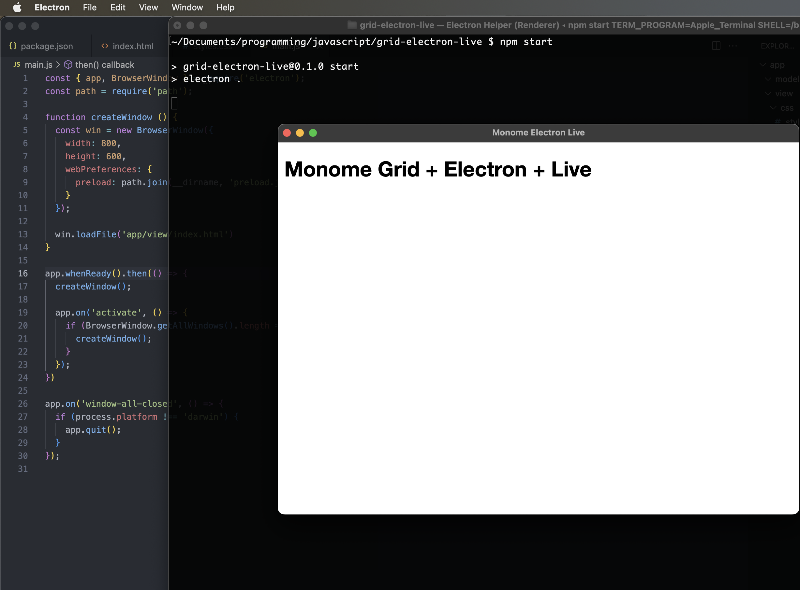

# Step 1: Stub out the initial Electron app

## 1.1 Installing Electron Node Packages

To get started, we are going to set up an Electron app by following the Electron Quick Start instructions:

[https://www.electronjs.org/docs/latest/tutorial/quick-start]

Fill in the entries below when the interactive prompt starts (though probably choose your own author name).

```
$ mkdir monome-electron-live
$ cd monome-electron-live
$ npm init
...
package name: (monome-electron-live)
version: (1.0.0) 0.1.0
description: A reference implementation app that connects a monome grid to Ableton Live
entry point: (index.js) main.js
test command:
git repository:
keywords: monome grid electron ableton live
author: Tables & Waves
license: (ISC)
...
```

Some of the interactive terminal output above has been replaced with "..." to save space here. Note that, per Electron Quick Start instructions, the default script should `main.js`. After this step, you should have a file named `package.json` in your directory.

Next install the Electron dependencies:

```
$ npm install --save-dev electron
```

This will create a `node_modules` directory and install a lot of node packages underneath it. It will also add the following entry to your `package.json` file:

```
"devDependencies": {
  "electron": "^25.2.0"
}
```

If you get a warning about vulnerabilities related to the `semver` node package, add an `overrides` entry to your `package.json` file:

```
"overrides": {
  "semver": "^7.5.3"
}
```

And then run the command `npm i` to update the version.

Getting back to the quick start guide, now you want to add a new "start" entry to `package.json` in the "scripts" section. It should look like this:

```
"scripts": {
  "test": "echo \"Error: no test specified\" && exit 1",
  "start": "electron ."
},
```

## 1.2 Set up an App Directory/File Structure

I'm a sucker for a little MVC style organization, so I am going to organize my files a bit. First set up some directories:

```
$ mkdir app
$ mkdir app/model
$ mkdir app/view
$ mkdir app/view/css
$ mkdir app/view/js
```

Then create the core files we will use:

```
$ touch app/view/index.html
$ touch app/view/css/styles.css
$ touch app/view/js/ui.js
$ touch main.js
$ touch preload.js
```

## Step 1.3: Test Run

For the newly created files listed below in **Code Updates for Step 1** (we'll get to `preload.js` and `ui.js` in later steps), add the HTML, CSS and JS code to the files just created.

Once that is done, you should be able to start the Electron app. It won't do anything besides launch a GUI in development mode, but it is your first check-point to see if all of this necessary but annoying plumbing is correctly setup:

```
$ npm start
```



If you are seeing something similar to the screenshot above, step 1 is complete.

## Code Updates for Step 1

### `./app/view/index.html`

```html
<!DOCTYPE html>
<html>
<head>
  <meta charset="UTF-8">
  <!-- https://developer.mozilla.org/en-US/docs/Web/HTTP/CSP -->
  <meta http-equiv="Content-Security-Policy" content="default-src 'self'; script-src 'self'">
  <title>Monome Electron Live</title>
  <link rel="stylesheet" href="css/styles.css">
</head>
<body>

<h1>Monome Grid + Electron + Live</h1>

<script src="js/ui.js"></script>
</body>
</html>
```

### `./app/view/css/styles.css`

```css
body {
  font-family: "Helvetica Neue", Helvetica, sans-serif;
  position: relative;
  margin: 10px;
}
```

### `./main.js`

This is mostly the same content as the Electron Quick Start guide, with the exception that the paths have been updated for this custom directory structure.

```js
const { app, BrowserWindow } = require('electron');
const path = require('path');

function createWindow () {
  const win = new BrowserWindow({
    width: 800,
    height: 600,
    webPreferences: {
      preload: path.join(__dirname, 'preload.js')
    }
  });

  win.loadFile('app/view/index.html')
}

app.whenReady().then(() => {
  createWindow();

  app.on('activate', () => {
    if (BrowserWindow.getAllWindows().length === 0) {
      createWindow();
    }
  });
})

app.on('window-all-closed', () => {
  if (process.platform !== 'darwin') {
    app.quit();
  }
});
```
