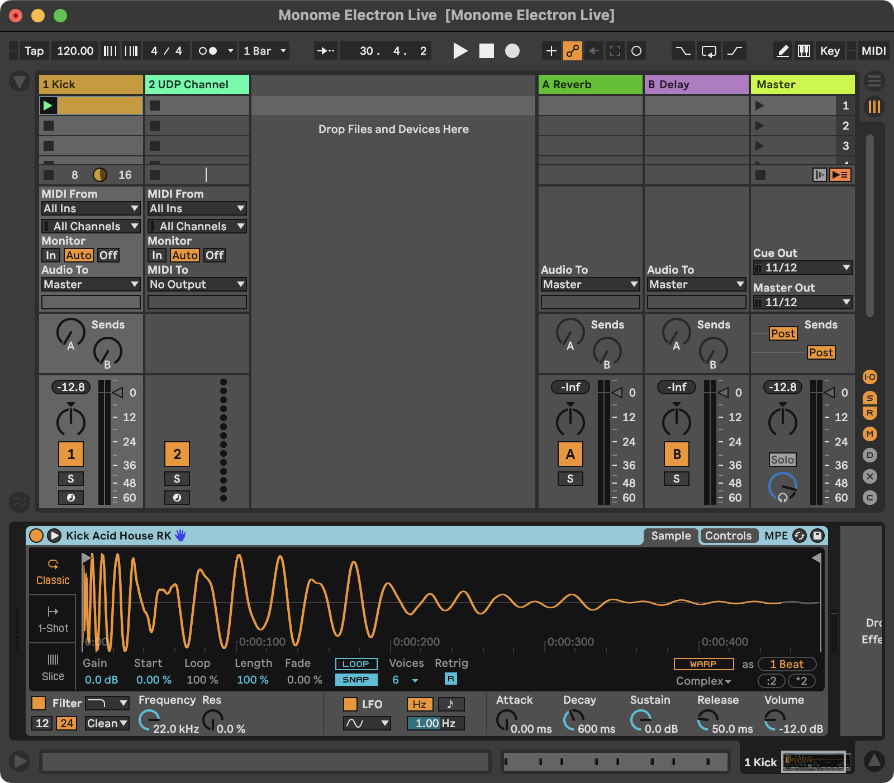
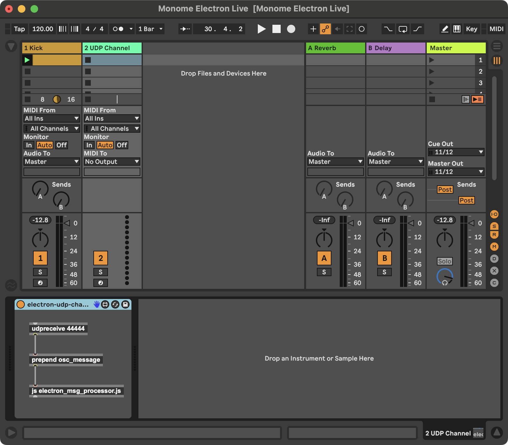

# Step 5: Ableton Live Note Sequence Integration

This step in the tutorial marks another big milestone: writing simple note data from the Electron sequencer into Ableton Live MIDI clips. To keep the amount of changes from being too overwhelming, at this point we are only going to add a kick drum track to Live and update a MIDI clip with the rhythm cooresponding to what is punched in on the grid. A future step in this tutorial will work with note melodies.

In this step, we will implement the ability to display the current rhythm on the grid hardware and in the Electron UI.

## Ableton Live Set Setup

To get started, create a new Ableton Live set with two MIDI tracks.

### Track 1: Kick Drum

On track 1, add a kick drum sample in a Simpler device. In the first clip slot add a blank MIDI clip and set the length to 4 bars. A future step in this tutorial will make clear why we are using a 4 bar MIDI clip.



### Track 2: Communication via Max for Live

On track 2, add a Max for Live MIDI device. The device should just have three objects as in the screenshot:

```
[udpreceive 44444] => [prepend osc_message] => [js electron_msg_processor.js]
```



You can use a different port number than 44444, but be sure to update it in the code as well (in the `AbletonLive` constructor). The `[js]` object will need access to a JavaScript file. It is strongly recomended that you save the M4L device (I named it `electron-udp-channel.amxd`) in a folder and save the JavaScript file `electron_msg_processor.js` in the same folder. The Max for Live device should not be saved with the Electron app, instead just save it within the normal Max for Live path. On my Mac, I have saved the device and its JS file at the path:

```
~/Music/Ableton/User Library/Presets/MIDI Effects/Max MIDI Effect/Monome Electron Live
```

#### UDP as OSC-like Communication

This M4L device receives communication from the Electron app, specifically the note data that should be used to update MIDI clips. Communication happens over an internal UDP network within your computer. This works because Max has the `[udpreceive]` object (and a send equivalent) and we can use the JavaScript package `osc-emitter` from our Node.js app to send messages into Live.

#### Updating Ableton Live Notes via Live Object Model (LOM)

Once data has found its way over the internal networking inside your computer, it is passed from the Max `[udpreceive]` object to the `[js]` object for processing. The `electron_msg_processor.js` script that receives note data then identifies the track index and clip index (both 0-based indexing per the LOM) based on an OSC-style message path. For example, when updating the first clip in the first track, the Electron app sends a message like the following:

```
/tracks/0/clips/0/notes {n groups of 5 numbers representing each note}
```

The track and clip indices are parsed out of the first entry in the message. The rest of the UDP message is made up of 1 or more groups of 5 numbers. Each number represents a different property of a note in Ableton Live:

1. MIDI note number
1. Clip position (placement on MIDI clip timeline)
1. Note duration
1. Note velocity
1. Note probability

After some experimentation, this implementation of sync'ing notes sent from the Electron app uses a simple method to *diff* the MIDI clip's current note list against the incoming note list. A delta is generated specifying the notes that should be added an any that should be removed. Using this method requires more processing and logic, but it does not remove and then re-add the same note if it exists in both the current and incoming note lists. The design goal is therefore to minimize the amount of data that changes in a clip so that changes are as minimally disruptive as possible while the Live's transport is running.

## Electron App Updates

This step in the tutorial introduces a few new classes to our data model:

* `AbletonTrack`: an object that will store state for a track's rhythm (and more data in the future)
* `AbletonNote`: an object that takes in basic parameters for Ableton note data and that can format the data for packing into a UDP message

## Code Updates for Step 5

The CSS changes below are a partial addition. All other updates below should replace the Step 4 code.

### `./app/model/ableton_live.js`

```js
const OscEmitter   = require("osc-emitter");
const easymidi     = require("easymidi");
const MonomeGrid   = require("./monome_grid");
const AbletonTrack = require("./ableton_track");


class AbletonLive {
  // For a sequencer with a 16th note pulse, 4 measures will be one "super measure" to enable a 64 step sequence
  superMeasure = 4;
  // this instance variable is set to an Electron BrowserWindow object and provides the communication channel
  // for updating the UI
  electronUi = undefined;
  // this instance variable is set to a MonomeGrid object and provides the communication channel to the hardware
  controller = undefined;
  // Store the track
  track = undefined;
  // 16n step count
  step = 0;


  constructor() {
    // Communication to the grid hardware
    this.controller = new MonomeGrid(this);

    // Communication from Live for MIDI clock
    this.midiIn     = new easymidi.Input("monome in", true);

    // Communication to Live for sending notes
    this.emitter = new OscEmitter();
    this.emitter.add("localhost", 44444);

    this.track = new AbletonTrack(this);
  }


  async connectToGrid() {
    const msg = await this.controller.connect();
    return msg;
  }


  async follow() {
    this.midiIn.on("clock", () => {
      this.ticks++;
      // 6 MIDI clock ticks equals a 16th note.
      if (this.ticks % 6 != 0) return;

      // console.log(
      //   "Bar: " + (Math.floor(this.step / 16) + 1) +
      //   " Beat: " + (Math.floor(this.step / 4) % 4 + 1) +
      //   " 16th Note: " + (this.step % this.superMeasure + 1)
      // );

      this.electronUi.webContents.send("transport", this.step % 16);
      this.controller.displayTransport(this.step % 16);
      this.step = this.step == this.superMeasure * 16 - 1 ? 0 : this.step + 1;
    });

    this.midiIn.on("start", () => {
    });

    this.midiIn.on("position", (data) => {
      if (data.value != 0) return;

      this.ticks = 0;
      this.step  = 0;
    });
  }


  setNotes(track) {
    const trackIndex = 0;
    const clipIndex  = 0;
    const notes      = track.abletonNotes();

    try {
      this.emitter.emit(
        `/tracks/${trackIndex}/clips/${clipIndex}/notes`,
        ...notes.flatMap(note => note.toOscNote())
      );
    } catch (e) {
      console.error(e.name, e.message, "while sending notes to Live:");
      console.error("input notes:", notes);
      console.error("OSC mapped notes", ...notes.flatMap(note => note.toOscAddedNote()));
      console.error("trackIndex", trackIndex);
    }
  }
}


module.exports = AbletonLive;
```

### `./app/model/ableton_note.js`

```js
class AbletonNote {

  constructor(midiNote, clipPosition, duration, velocity, probability) {
    this.midiNote = midiNote;
    this.clipPosition = clipPosition;
    this.duration = duration;
    this.velocity = velocity;
    this.probability = probability == undefined ? 1.0 : probability;
  }


  toOscNote() {
    return [
      {type: "integer", value: this.midiNote},
      {type: "float",   value: this.clipPosition},
      {type: "float",   value: this.duration},
      {type: "float",   value: this.velocity},
      {type: "float",   value: this.probability}
    ];
  }
}


module.exports = AbletonNote;
```

### `./app/model/ableton_track.js`

```js
const AbletonNote = require("./ableton_note");


class AbletonTrack {
  daw = undefined;
  rhythm = [0, 0, 0, 0,  0, 0, 0, 0,  0, 0, 0, 0,  0, 0, 0, 0];


  constructor(abletonLive) {
    this.daw = abletonLive;
  }


  updateRhythm(stepIndex) {
    // Flip the step's current value. If currently 0, set to 1; if 1, set to 0;
    this.rhythm[stepIndex] = 1 - this.rhythm[stepIndex];

    // Update the MIDI clip info in Live
    this.daw.setNotes(this);

    // Update the grid display
    this.daw.controller.displayTransport();

    // Update the Electron UI display
    this.daw.electronUi.webContents.send("update-rhythm", this.rhythm);
  }


  abletonNotes() {
    const notes = new Array();

    for (let i = 0; i < this.daw.superMeasure; i++) {
      const measureOffset = i * 4;
      this.rhythm.forEach((step, i) => {
        if (step == 1) {
          notes.push( new AbletonNote(60, ((i * 0.25) + measureOffset), 0.25, 64) )
        }
      });
    }

    return notes;
  }
}


module.exports = AbletonTrack;
```

### `./app/model/monome_grid.js`

```js
const fs        = require("fs");
const path      = require("path");
const yaml      = require("js-yaml");
const serialosc = require("serialosc");


const CONFIG_DIRECTORY = path.resolve(__dirname, "../../config");
const blank16x1Row = [0, 0, 0, 0, 0, 0, 0, 0, 0, 0, 0, 0, 0, 0, 0, 0];


class MonomeGrid {
  device = undefined;
  daw = undefined;


  constructor(abletonLive) {
    this.daw = abletonLive;
  }


  /**
   * This is fundamentally the same code as the monome website's grid studies.
   */
  async connect() {
    const config = yaml.load(
      fs.readFileSync(
        path.resolve(CONFIG_DIRECTORY, "grid.yml"),
        "utf8"
      )
    );

    return new Promise((resolve, reject) => {
      let addEvent = config.serial + ":add";

      serialosc.start({ startDevices: false });

      serialosc.on(addEvent, (device) => {
        if (this.device)           return;
        if (device.type != 'grid') return;

        this.device = device;
        this.device.on('initialized', () => this.device.on('key', (press) => this.keyPress(press)));
        this.device.start();

        resolve(`Connected to ${this.device.model} ${this.device.id} on ${this.device.deviceHost}:${this.device.devicePort}`);
      });
    });
  }


  keyPress(press) {
    console.log(press);
    if (press.y == 0 && press.s == 1) {
      this.daw.track.updateRhythm(press.x);
    }
  }


  clearGridDisplay(rowCount = 7) {
    for (let y = 0; y < rowCount; y++) {
      this.levelRow(0, y, blank16x1Row.slice(0, 8));
      this.levelRow(8, y, blank16x1Row.slice(8, 16));
    }
  }


  displayTransport(highlightIndex) {
    let row = this.daw.track.rhythm.map(step => step == 1 ? 10 : 0);
    if (highlightIndex != undefined) row[highlightIndex] = 15;

    this.levelRow(0, 0, row.slice(0, 8));
    this.levelRow(8, 0, row.slice(8, 16));
  }


  levelRow(xOffset, y, row) {
    this.device.levelRow(xOffset, y, row);
  }
}


module.exports = MonomeGrid;
```

### `./app/view/css/styles.css`

There are only two additional CSS entries:

```css
div#sequencer-steps div span {
  display: inline-block;
  width: 40px;
  height: 40px;
  position: absolute;
  background-color: #fff;  /* transparent white: on gate step probability */
  opacity: 0.4;
}


div#sequencer-steps div span.on {
  background-color: #333;
}
```

### `./app/view/js/ui.js`

```js
let previousStep = 15;


window.stepSequencer.transport((event, currentStep) => updateTransport(currentStep));
window.stepSequencer.setRhythmDisplay((event, rhythm) => updateRhythm(rhythm));


const updateTransport = (currentStep) => {
  document.querySelector(`#sequencer-steps .step-${previousStep}`).classList.remove("current");
  document.querySelector(`#sequencer-steps .step-${currentStep}`).classList.add("current");
  previousStep = currentStep;
}


const updateRhythm = (rhythm) => {
  rhythm.forEach((step, i) => {
    if (step == 0) {
      document.querySelector(`#sequencer-steps .step-${i} span`).classList.remove("on");
    } else {
      document.querySelector(`#sequencer-steps .step-${i} span`).classList.add("on");
    }
  });
}
```

### `./preload.js`

```js
const { contextBridge, ipcRenderer } = require("electron");


contextBridge.exposeInMainWorld("stepSequencer", {
  transport: (callback) => ipcRenderer.on("transport", callback),
  setRhythmDisplay: (callback) => ipcRenderer.on("update-rhythm", callback)
});
```

