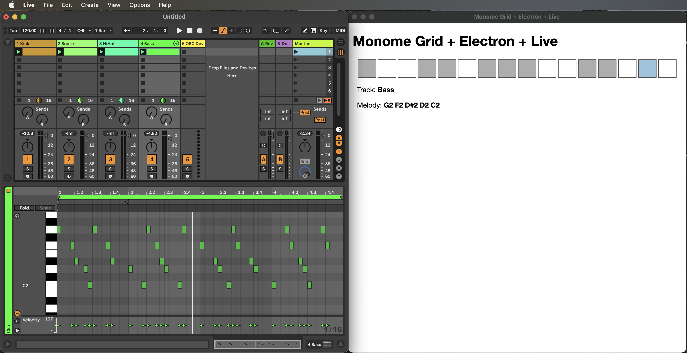

# Step 6: Multitrack Sequencer & Melodies

At this point in the tutorial, the momentum is starting to shift. This step will deal with the last two pieces of plumbing and lay the foundation for focusing on creative coding. In this step, we will be implementing:

1. multi-track sequencing, and
1. the ability to write melodic lines into Live MIDI clips in addition to the rhythms

## Updates to the Ableton Live Set

To get everything prepared on the Live side of things, we need to add a few more tracks to our Live set. Add 3 more MIDI tracks in the set and make sure they are the 2nd, 3rd and 4th tracks, which will push the UDP Channel track that stores the Max for Live device to track 5. Just like in step 4 of this tutorial, on each of the new tracks, create a MIDI clip that is four bars long. While not strictly necessary, in order to keep things in sync conceptually between the Electron app code and Live, name tracks 2-4 Snare, HiHat and Bass. Eventually we are going to end up with something like the following combination of Live and Electron:



## Implementing a Multi-track Sequencer

### Updates to the Model Objects: `AbletonLive` & `AbletonTrack`

The reason in step 4 of this tutorial we created the `AbletonTrack` class was so it could be reused. Here we are going to create an instance of this class for each of the four tracks, Kick, Snare, HiHat and Bass, in this sequencer. In step 4, for the sake of expediency when working out the OSC-like communication, we hard-coded a single `AbletonTrack` object as a property of the `AbletonLive` class.

To start things off in this next version, the new code for step 5 instead has a property which is an array holding onto 4 `AbletonTrack` objects. In order to make it easy to know which track is *active* and currently being edited, the `AbletonLive` class also has a property `activeTrack`, which is a number between 0 and 3 that corresponds the index of the currently editable track in that array.

For the sake of convenience, the `AbletonTrack` class has also been updated so that it has a `name` property. This is useful if you need to debug things (`console.log(track)`) and important for displaying the active track in the Electron UI.

### monome grid Controller Updates

The monome grid hardware is the tactile interface for this project. Up to this point we have dedicated the the top row of the grid as the interface to a single track's 16 step sequencer. Next up, we will use the bottom row as a kind of *global* row in which we select the active track (and as we'll see below, to manage melody recording). This tutorial is based on using a 16 by 8, 128 button grid. So the bottom row in this tutorial code is hard-coded to row 8, or row index 7 (we interact with the grid in code using a 0-based indexing system).

This step of the tutorial includes a handful of updates to the `MonomeGrid#keyPress()` method. At this point I would like to draw your attention to the conditional

```js
} else if (press.y == 7 && press.x >= 0 && press.x <= 3) {

  // Row 8 (Row Index 7), Buttons 1-4: select active track
  this.#activateTrack(press.x);

}
```

What this code does is catch button presses on the first four buttons of the 8th row of the grid. When one of those button presses occurs, the code calls the private method (in JavaScript, methods whose names start with a `#` sign are not exposed outside the class in which they reside) `#activateTrack()`. This method will then update the grid's button lights, set the `activeTrack` property of the `AbletonLive` class and then update the display of the current rhythm on both the grid hardware and in the Electron UI.

This last step is important. For example, if you have programmed in a standard Boots 'n Cats rhythm, when the active track is set to the kick drum track and you press row 8, column 2 on the grid for the snare track, the display of the rhythm on both the top row of the grid hardware and in the squares that display in the UI should change from one that has a gate/hit on each quarter note to one that only has a gate/hit on the 2nd and 4th quarter notes.

Note that there has also been a change to the `keyPress()` condition that corresponds to the top row:

```js
if (press.y == 0) {

  // Row 1 (Row Index 0): Update the rhythm for the active track
  this.daw.getActiveTrack().updateRhythm(press.x);

}
```

The `MonomeGrid` class needs to know which of the `AbletonLive` classes is being updated. To accommodate this, the `AbletonLive` class now has a method to return the specific track that is active.

Finally, it should be noted that when data changes in the Electron app that needs to sync with Live, the `AbletonLive` class's `setNotes()` method now uses the `activeTrack` property when sending its OSC-style message to Live so the correct track is updated.

## Implementing Melodies

As mentioned above, the code updates for this step in the tutorial also include a mechanism to process melodic lines. At this point we are finally able to explain this concept of super measures that is embedded into the code previously, but without explanation. Let's kick this section off with a discussion of a 4/4 time, 1 bar sequencer (16 16th notes) and the use of 4 bar MIDI clips in Live...

### Loosely Coupled Gate & Note Sequences & the Super Measure

The reasoning here is simple: the style of rhythmic and note sequencing implemented in this app does not require that the rhythmic *gate* count and the melodic line *note* count have to be in sync with each other. For example, the rhythmic line of a sequence could simply be based on four-to-the-floor gates on each quarter note. At the same time, the note sequence could have five notes in it: G F Eb D C. For the sake of space, consider this 2 bar loop that represents these disconnected rhythmic and melodic sequences:

```
16th note pulse: 1 e & a 2 e & a 3 e & a 4 e & a 1 e & a 2 e & a 3 e & a 4 e & a
Rhythmic gates:  *       *       *       *       *       *       *       *
Melodic line:    G       F       Eb      D       C       G       F       Eb
```

The loose coupling of rhythm and melody allows the melodic sequence to end on the first beat of the second measure and the restart with the next G, the first note in the melodic sequence, on beat 2 of the second measure. In this 2 bar example, the second iteration of the melodic loop never completes. In the lingo of the application code for this tutorial, this would be a 2 bar super measure. At the start of each super measure, both the rhythmic and melodic sequences re-lock/re-sync with each other.

You may think this is a silly or non-musical way of implementing a sequencer. However, that is precisely the point of this tutorial and ultimately developing an application like this: it is your choice. The concept that lies behind "super measure" in these examples illustrates how you might find wiggle room to do non-standard things. Just freaking cuz.

### Code Highlights for the Melody Implementation

The melody implementation here is found primarily in the `MonomeGrid` and `AbletonTrack` classes. The former manages the recording of a melodic sequence as grid button presses. This functionality is first enabled by toggling a "melody recording" button, assigned to the last button in row 8.

When the melody recording button is pressed it lights up to indicate melody recording is active. When active, the app will begin listening for button presses in rows 2-7 between columns 1-12. Within this 12 column by 6 row matrix, the application defines the notes within the Western chromatic scale that is the default used by Ableton Live. Columns 1-12 (indices 0-11) correspond to the notes C through B and each row going up from row 7/index 6 to row 2/index 1 corresponds to an octave. Going from bottom to top, the buttons in column 1 (column index 0) will be C1, C2, C3, C4, C5, C6. The corresponding column 2 buttons will be C#1, C#2, C#3, C#4, C#5, C#6.

The `MonomeGrid` class has a `queuedMelody` property. Button presses are recorded into this array as number pairs: a the MIDI note index between 0-11 and an octave number. Note that the octave number inverts the grid indices so that octave 6 corresponds to 2 and octave 1 corresponds to row 7. The use of the `queuedMelody` property also allows the musician operating the grid to wait until the entire melodic sequence is programmed into the app before *flushing* the melody to an Ableton Live MIDI clip.

This brings us to the final button press defined in the `MonomeGrid#keyPress()` method. Row 8, button 15 is used to flush the melody to the active `AbletonTrack` object and ultimately to the corresponding Live MIDI clip. This is accomplish by passing the `queuedMelody` to the active track's `setMelody()` method where the `queuedMelody` note data pairs are translated to MIDI note numbers. At the same time, an array of notes suitable for display in the UI is generated (the `displayMelody` property).

The `AbletonTrack#abletonNotes()` method is where you will find the code that implements the loosely coupled gate and melodic sequences. By simply using a modulo operator `%` for looping through the melodic sequence for each "on" gate in the track's rhythm, the melody will simply loop *as needed* for the current rhythm.

## Code Updates for Step 6

The HTML and `main.js` changes below are a partial addition. All other updates below should replace the Step 5 code.

### `./app/model/ableton_live.js`

```js
const OscEmitter   = require("osc-emitter");
const easymidi     = require("easymidi");
const MonomeGrid   = require("./monome_grid");
const AbletonTrack = require("./ableton_track");


class AbletonLive {
  // For a sequencer with a 16th note pulse, 4 measures will be one "super measure" to enable a 64 step sequence
  superMeasure = 4;
  // this instance variable is set to an Electron BrowserWindow object and provides the communication channel
  // for updating the UI
  electronUi = undefined;
  // this instance variable is set to a MonomeGrid object and provides the communication channel to the hardware
  controller = undefined;
  // Store the tracks
  tracks = new Array();
  // Keep track of the active track
  activeTrack = 0;
  // 16n step count
  step = 0;


  constructor() {
    // Communication to the grid hardware
    this.controller = new MonomeGrid(this);

    // Communication from Live for MIDI clock
    this.midiIn     = new easymidi.Input("monome in", true);

    // Communication to Live for sending notes
    this.emitter = new OscEmitter();
    this.emitter.add("localhost", 44444);

    ["Kick", "Snare", "HiHat", "Bass"].forEach(trackName => {
      this.tracks.push( new AbletonTrack(trackName, this) );
    });
  }


  getActiveTrack() {
    return this.tracks[this.activeTrack];
  }


  async connectToGrid() {
    const msg = await this.controller.connect();
    return msg;
  }


  async follow() {
    this.midiIn.on("clock", () => {
      this.ticks++;
      // 6 MIDI clock ticks equals a 16th note.
      if (this.ticks % 6 != 0) return;

      this.electronUi.webContents.send("transport", this.step % 16);
      this.controller.displayTransport(this.step % 16);
      this.step = this.step == this.superMeasure * 16 - 1 ? 0 : this.step + 1;
    });

    this.midiIn.on("start", () => {
    });

    this.midiIn.on("position", (data) => {
      if (data.value != 0) return;

      this.ticks = 0;
      this.step  = 0;
    });
  }


  setNotes(track) {
    const clipIndex = 0;
    const notes     = track.abletonNotes();

    try {
      this.emitter.emit(
        `/tracks/${this.activeTrack}/clips/${clipIndex}/notes`,
        ...notes.flatMap(note => note.toOscNote())
      );
    } catch (e) {
      console.error(e.name, e.message, "while sending notes to Live:");
      console.error("input notes:", notes);
      console.error("OSC mapped notes", ...notes.flatMap(note => note.toOscAddedNote()));
      console.error("trackIndex", trackIndex);
    }
  }
}


module.exports = AbletonLive;
```

### `./app/model/ableton_track.js`

```js
const AbletonNote = require("./ableton_note");


const noteNames = ["C", "C#", "D", "D#", "E", "F", "F#", "G", "G#", "A", "A#", "B"];


class AbletonTrack {
  daw = undefined;
  name = undefined;
  rhythm = [0, 0, 0, 0,  0, 0, 0, 0,  0, 0, 0, 0,  0, 0, 0, 0];
  melody = [60];
  displayMelody = ["C4"];


  constructor(name, abletonLive) {
    this.name = name;
    this.daw  = abletonLive;
  }


  updateRhythm(stepIndex) {
    // Flip the step's current value. If currently 0, set to 1; if 1, set to 0;
    this.rhythm[stepIndex] = 1 - this.rhythm[stepIndex];

    // Update the MIDI clip in Live
    this.daw.setNotes(this);

    // Update the grid display
    this.daw.controller.displayTransport();

    // Update the Electron UI display
    this.daw.electronUi.webContents.send("update-rhythm", this.rhythm);
  }


  setMelody(queuedMelody) {
    // Translate the note data pairs that look like [0, 3], meaning 0=C in the third octave to MIDI note number 36
    this.melody        = queuedMelody.map(noteData => noteData[0] + (noteData[1] * 12) + 24);
    this.displayMelody = queuedMelody.map(noteData => noteNames[noteData[0]] + noteData[1]);

    // Update the MIDI clip in Live
    this.daw.setNotes(this);

    // Update the Electron UI display
    this.daw.electronUi.webContents.send("update-melody", this.displayMelody);

  }


  abletonNotes() {
    const notes = new Array();
    let melodyIndex = 0;

    for (let i = 0; i < this.daw.superMeasure; i++) {
      const measureOffset = i * 4;
      this.rhythm.forEach((step, i) => {
        if (step == 1) {
          let midiNoteNumber = this.melody[melodyIndex % this.melody.length];
          melodyIndex++;

          notes.push( new AbletonNote(midiNoteNumber, ((i * 0.25) + measureOffset), 0.25, 64) )
        }
      });
    }

    return notes;
  }
}


module.exports = AbletonTrack;
```

### `./app/model/monome_grid.js`

```js
const fs        = require("fs");
const path      = require("path");
const yaml      = require("js-yaml");
const serialosc = require("serialosc");


const CONFIG_DIRECTORY = path.resolve(__dirname, "../../config");
const blank16x1Row = [0, 0, 0, 0, 0, 0, 0, 0, 0, 0, 0, 0, 0, 0, 0, 0];


class MonomeGrid {
  device = undefined;
  daw = undefined;
  melodyRecording = 0;
  queuedMelody = new Array();


  constructor(abletonLive) {
    this.daw = abletonLive;
  }


  /**
   * This is fundamentally the same code as the monome website's grid studies.
   */
  async connect() {
    const config = yaml.load(
      fs.readFileSync(
        path.resolve(CONFIG_DIRECTORY, "grid.yml"),
        "utf8"
      )
    );

    return new Promise((resolve, reject) => {
      let addEvent = config.serial + ":add";

      serialosc.start({ startDevices: false });

      serialosc.on(addEvent, (device) => {
        if (this.device)           return;
        if (device.type != 'grid') return;

        this.device = device;
        this.device.on('initialized', () => this.device.on('key', (press) => this.keyPress(press)));
        this.device.start();

        resolve(`Connected to ${this.device.model} ${this.device.id} on ${this.device.deviceHost}:${this.device.devicePort}`);
      });
    });
  }


  keyPress(press) {

    // Ignore button releases
    if (press.s == 0) return;

    if (press.y == 0) {

      // Row 1 (Row Index 0): Update the rhythm for the active track
      this.daw.getActiveTrack().updateRhythm(press.x);

    } else if (press.y == 7 && press.x >= 0 && press.x <= 3) {

      // Row 8 (Row Index 7), Buttons 1-4: select active track
      this.#activateTrack(press.x);

    } else if (press.y == 7 && press.x == 14) {

      // Flush Melody to Live
      if (this.queuedMelody.length > 0) {
        this.daw.getActiveTrack().setMelody(this.queuedMelody);
      }

    } else if (press.y == 7 && press.x == 15) {

      // Toggle Melody Recording Mode
      this.melodyRecording = !this.melodyRecording;
      this.levelSet(15, 7, this.melodyRecording ? 10 : 0);

      if (this.melodyRecording) this.queuedMelody = new Array();

    } else if (press.y >= 1 && press.y <= 6 && press.x <= 11) {

      // Rows 2-7, Buttons 1-12: Chromatic Keyboard
      if (this.melodyRecording) {
        // Store the current key press in the currently accumulating melody as a number pair:
        // press.x = MIDI note index within a single octave (e.g., C = 0, C# = 1...)
        // press.y = MIDI octave number, oriented so Row 1 (highest vertically on grid) is octave 6
        //           and Row 7 (lowest vertically on the grid) is octave 1
        this.queuedMelody.push([press.x, 6 - press.y + 1]);
      }
    }
  }


  #activateTrack(trackIndex) {
    // First, turn off the button for the current track, then turn on the button for the newly selected track
    this.levelSet(this.daw.activeTrack, 7, 0);
    this.levelSet(trackIndex, 7, 10);

    // Then, activate the track and refresh the grid and UI displays
    this.daw.activeTrack = trackIndex;
    this.displayTransport();
    this.daw.electronUi.webContents.send(
      "update-track",
      // Note that due to the Electron security model, the AbletonTrack object cannot be serialized. Creating
      // a simple object that is passed thru the context bridge.
      {
        name: this.daw.getActiveTrack().name,
        rhythm: this.daw.getActiveTrack().rhythm,
        melody: this.daw.getActiveTrack().displayMelody
      }
    );
  }


  clearGridDisplay(rowCount = 7) {
    for (let y = 0; y < rowCount; y++) {
      this.levelRow(0, y, blank16x1Row.slice(0, 8));
      this.levelRow(8, y, blank16x1Row.slice(8, 16));
    }
  }


  displayTransport(highlightIndex) {
    let row = this.daw.getActiveTrack().rhythm.map(step => step == 1 ? 10 : 0);
    if (highlightIndex != undefined) row[highlightIndex] = 15;

    this.levelRow(0, 0, row.slice(0, 8));
    this.levelRow(8, 0, row.slice(8, 16));
  }


  levelSet(x, y, s) {
    this.device.levelSet(x, y, s);
  }


  levelRow(xOffset, y, row) {
    this.device.levelRow(xOffset, y, row);
  }
}


module.exports = MonomeGrid;
```

### `./app/view/css/styles.css`

```css
body {
  font-family: "Helvetica Neue", Helvetica, sans-serif;
  position: relative;
  margin: 10px;
}


div.wrapper {
  position: relative;
  float: left;
}


div#sequencer-steps,
div#current-track {
  width: 800px;
  margin: auto 10px;
}


div#sequencer-steps div {
  width: 40px;
  height: 40px;
  margin: 2px;
  background-color: #fff;  /* dark gray: background color for inactive step */
  border: 1px solid #333;  /* medium gray: border color for active step */
}


div#sequencer-steps div.active {
  background-color: #fff;  /* medium gray: background color for active step */
  border: 1px solid #555;  /* medium-light gray: border color for active step */
}


div#sequencer-steps div.current {
  background-color: #31a1ce; /* green: highlight background color for current transport step */
}


div#sequencer-steps div span {
  display: inline-block;
  width: 40px;
  height: 40px;
  position: absolute;
  background-color: #fff;  /* transparent white: on gate step probability */
  opacity: 0.4;
}


div#sequencer-steps div span.on {
  background-color: #333;
}


div#current-track span {
  font-weight: bold;
}
```

### `./app/view/js/ui.js`

```js
let previousStep = 15;


window.stepSequencer.transport((event, currentStep) => updateTransport(currentStep));
window.stepSequencer.setRhythmDisplay((event, rhythm) => updateRhythm(rhythm));
window.stepSequencer.setActiveTrack((event, track) => updateTrack(track));
window.stepSequencer.setMelodyDisplay((event, melody) => updateMelody(melody));


const updateTransport = (currentStep) => {
  document.querySelector(`#sequencer-steps .step-${previousStep}`).classList.remove("current");
  document.querySelector(`#sequencer-steps .step-${currentStep}`).classList.add("current");
  previousStep = currentStep;
}


const updateRhythm = (rhythm) => {
  rhythm.forEach((step, i) => {
    if (step == 0) {
      document.querySelector(`#sequencer-steps .step-${i} span`).classList.remove("on");
    } else {
      document.querySelector(`#sequencer-steps .step-${i} span`).classList.add("on");
    }
  });
}


const updateMelody = (melody) => {
  document.querySelector("#track-melody span").textContent = melody.join(" ");
}


const updateTrack = (track) => {
  document.querySelector("#track-name span").textContent = track.name;
  updateRhythm(track.rhythm);
  updateMelody(track.melody);
}
```

### `./app/view/index.html`

After the `<div id="sequencer-steps" class="wrapper">` element, add:

```html
<div id="current-track" class="wrapper">
  <p id="track-name">
    Track: <span>Kick</span>
  </p>
  <p id="track-melody">
    Melody: <span>C4</span>
  </p>
</div>
```

### `./preload.js`

```js
const { contextBridge, ipcRenderer } = require("electron");


contextBridge.exposeInMainWorld("stepSequencer", {
  transport: (callback) => ipcRenderer.on("transport", callback),
  setRhythmDisplay: (callback) => ipcRenderer.on("update-rhythm", callback),
  setActiveTrack: (callback) => ipcRenderer.on("update-track", callback),
  setMelodyDisplay: (callback) => ipcRenderer.on("update-melody", callback)
});
```

### `./main.js`

After the call to `daw.follow()` add

```js
// The grid needs a moment to be fully ready. Wait half a second, then simulate a key press
// to set the grid to the track 1, rhythm page.
setTimeout(() => {
  daw.controller.keyPress({x: 0, y: 7, s: 1});
  daw.controller.keyPress({x: 6, y: 7, s: 1});
}, 500);
```
